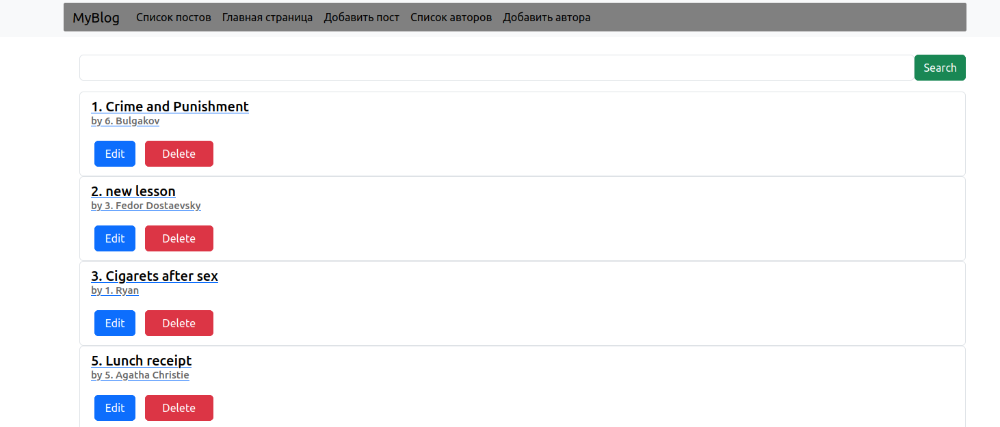
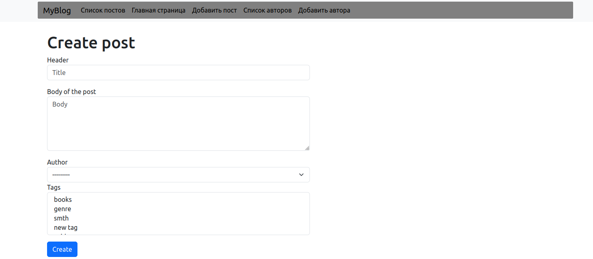
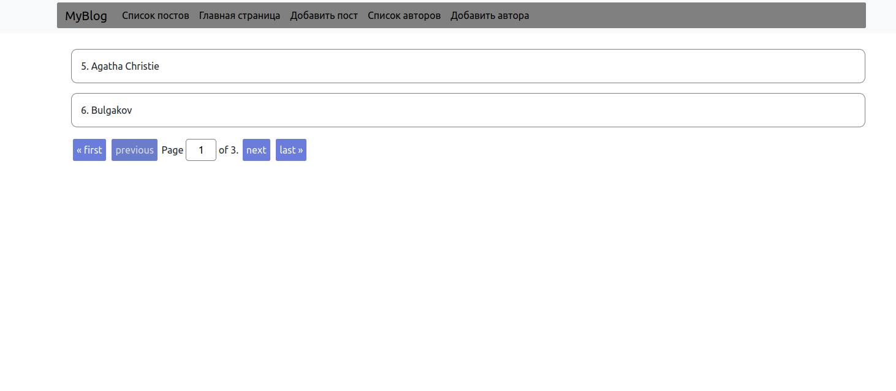
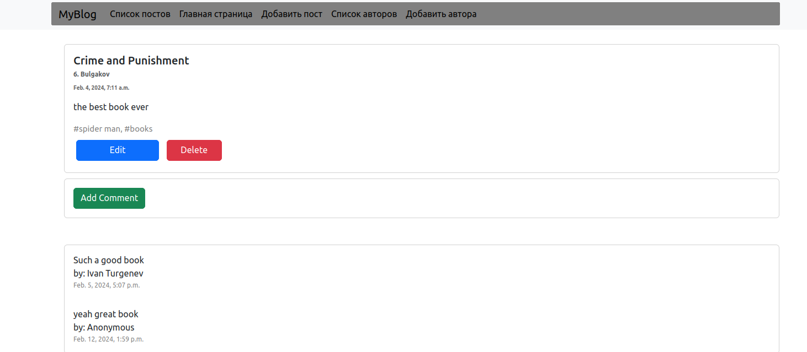

## Django project in course outpeer.kz
## About the project:
### Simple blog application with django
* user can create post, delete, update (CRUD)
* user can choose authors of the post, and comment to post
* also used paginator for large data

